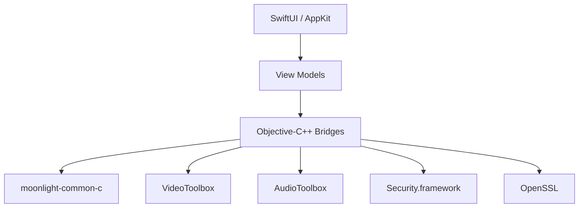

<h1 align="center">🌙 Selene</h1>

<p align="center">
  A native macOS client for Sunshine & NVIDIA GameStream.
  <br>
  Built with SwiftUI and Apple's native frameworks.
</p>

<p align="center">
  <a href="#-features">Features</a> ·
  <a href="#-status">Status</a> ·
  <a href="#-installation">Installation</a> ·
  <a href="#-architecture">Architecture</a> ·
  <a href="#-building">Building</a> ·
  <a href="#-license">License</a>
</p>

<p align="center">
  
  
  
  <a href="LICENSE">
    
  </a>
</p>

---

Selene is a native macOS client for Sunshine and NVIDIA GameStream built on the Moonlight protocol.

Originally forked from `moonlight-qt`, the project has since evolved into a complete native rewrite focused exclusively on macOS. While the original protocol implementation is still reused where it makes sense, the application itself follows its own roadmap and architecture.

> **Apple Silicon only.**
>
> This is a deliberate design decision. Apple has been deprecating Intel Macs for years, and supporting a platform that is already approaching end-of-life doesn't make sense for a brand-new project. Additionally, there is no Intel hardware available for testing, so any compatibility claim would be unreliable.

---

# ✨ Features

- ✅ Native SwiftUI + AppKit interface
- ✅ Bonjour host discovery
- ✅ Manual host discovery over VPN or WAN
- ✅ NVIDIA GameStream PIN pairing
- ✅ Hardware H.264 decoding (VideoToolbox)
- ✅ Native Opus decoding (AudioToolbox)
- ✅ Keyboard & mouse forwarding
- ✅ Session background / resume support
- ✅ Real Sunshine compatibility

---

# 🚀 Status

Selene is currently undergoing a complete ground-up rewrite.

| Component | Status                                       |
| --------- | -------------------------------------------- |
| `Selene/` | 🟢 Native Swift client (active development)  |
| `app/`    | ⚪ Legacy Qt implementation (reference only) |

The native client already supports complete end-to-end streaming against real Sunshine hosts, including video, audio, input, pairing and session management.

---

# 📦 Installation

Selene isn't notarized by Apple (no paid Developer ID behind this project yet), so macOS will flag it as coming from an unidentified developer. Both options below account for that.

### Recommended: install script

Open Terminal and run:

```bash
curl -fsSL https://raw.githubusercontent.com/Polonium-ch/Selene/main/install.sh | bash
```

This grabs the latest release, installs `Selene.app` to `/Applications`, and clears the quarantine flag so it opens normally on the first launch.

### Manual

- **Download the `.dmg`** from the [latest release](https://github.com/Polonium-ch/Selene/releases/latest), open it, drag `Selene.app` to `/Applications`, then clear the quarantine flag yourself:
  ```bash
  xattr -cr /Applications/Selene.app
  ```
- **Or build it from source** - see [Building](#-building) below.

---

# 🏗 Architecture



### Stack

| Layer     | Technology         |
| --------- | ------------------ |
| UI        | SwiftUI + AppKit   |
| Streaming | moonlight-common-c |
| Video     | VideoToolbox       |
| Audio     | AudioToolbox       |
| TLS       | Security.framework |
| Crypto    | OpenSSL            |
| Build     | Xcode              |

<details>

<summary><strong>Architecture details</strong></summary>

The native client intentionally relies on Apple's own frameworks wherever practical instead of introducing third-party dependencies.

Current implementation includes:

- SwiftUI for the complete application interface.
- `moonlight-common-c` for the GameStream protocol implementation.
- Objective-C++ bridges between Swift and the Moonlight engine.
- VideoToolbox with `AVSampleBufferDisplayLayer` for hardware H.264 decoding.
- AudioToolbox (`AudioConverter`) for native Opus decoding.
- Security.framework for Keychain-backed TLS identities.
- OpenSSL for Moonlight-compatible RSA identity generation.

Long-term, networking and cryptographic orchestration are planned to migrate to Rust while preserving the existing Swift UI and Moonlight protocol engine.

</details>

---

# ✅ Current Progress

### Streaming

- ✅ Sunshine pairing
- ✅ App list browsing
- ✅ Box art loading
- ✅ Video streaming
- ✅ Audio streaming
- ✅ Keyboard input
- ✅ Mouse input
- ✅ Background / Resume

### Networking

- ✅ Bonjour discovery
- ✅ Manual host connection
- ✅ LAN
- ✅ VPN

---

# 🚧 Roadmap

- [ ] Gamepad support
- [ ] HEVC decoding
- [ ] AV1 decoding
- [ ] Surround audio
- [ ] Codec capability negotiation
- [ ] Preferences window
- [ ] Streaming settings
- [ ] Performance metrics

---

# 🛠 Building

## Native Client

Requirements:

- Apple Silicon Mac
- Xcode
- OpenSSL (`brew install openssl@3`)

```bash
cd Selene

xcodebuild \
    -project Selene.xcodeproj \
    -scheme Selene \
    -configuration Debug \
    build
```

---

<details>

<summary><strong>Legacy Qt client (reference only)</strong></summary>

The original Qt implementation is preserved exclusively as a reference while the native client reaches feature parity.

Requirements:

- Qt 6.7+
- Apple Silicon Mac
- Xcode

```bash
git submodule update --init --recursive

python3 setup-deps.py

qmake6 moonlight-qt.pro

make release
```

</details>

---

# 📄 License

Selene is licensed under the GNU GPL v3, the same license used by Moonlight.

---

# 🙏 Acknowledgements

Selene would not exist without the incredible work behind the Moonlight and Sunshine projects.

Huge thanks to both communities for building and maintaining the protocol and streaming ecosystem this project is based on.
