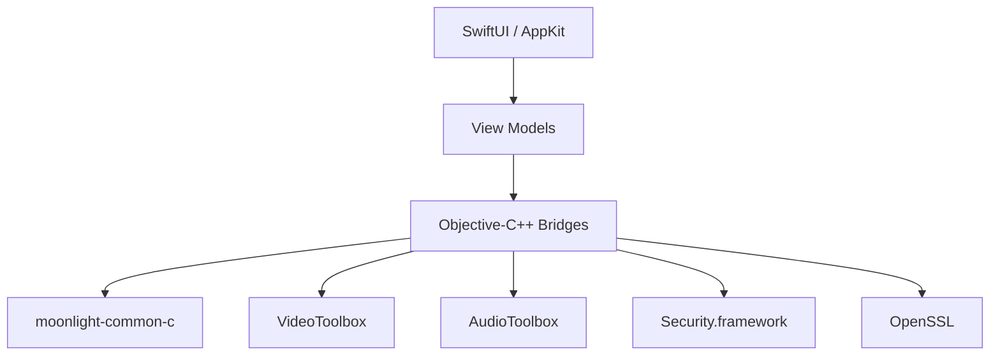

<h1 align="center">🌙 Selene</h1>

<p align="center">
  A native macOS client for Sunshine & NVIDIA GameStream.
  <br>
  Built with SwiftUI and Apple's native frameworks.
</p>

<p align="center">
  <a href="#-features">Features</a> ·
  <a href="#-status">Status</a> ·
  <a href="#-installation">Installation</a> ·
  <a href="#-architecture">Architecture</a> ·
  <a href="#-building">Building</a> ·
  <a href="#-license">License</a>
</p>

<p align="center">
  
  
  
  <a href="LICENSE">
    
  </a>
</p>

---

Selene is a native macOS client for Sunshine and NVIDIA GameStream built on the Moonlight protocol.

Originally forked from `moonlight-qt`, the project has since evolved into a complete native rewrite focused exclusively on macOS. While the original protocol implementation is still reused where it makes sense, the application itself follows its own roadmap and architecture.

> **Apple Silicon only.**
>
> This is a deliberate design decision. Apple has been deprecating Intel Macs for years, and supporting a platform that is already approaching end-of-life doesn't make sense for a brand-new project. Additionally, there is no Intel hardware available for testing, so any compatibility claim would be unreliable.

---

# ✨ Features

### Streaming

- App library browsing with box art
- Hardware H.264 decoding (VideoToolbox)
- Native Opus audio decoding (AudioToolbox), with stereo, 5.1, and 7.1 output
- Session background / resume support
- Blurred box-art backdrop while connecting

### Discovery & Pairing

- Bonjour (mDNS) host discovery on the LAN
- Manual host entry for VPN or WAN setups
- NVIDIA GameStream / Sunshine PIN pairing

### Input

- Keyboard & mouse forwarding
- Gamepad support for any controller macOS pairs natively through the GameController framework (DualSense, DualShock 4, Xbox, and other MFi/HID pads) — buttons, sticks, and analog triggers are forwarded; rumble, touchpad, motion, and battery reporting aren't wired up yet

### Settings & Personalization

- Native Settings window — resolution, frame rate, bitrate, audio channels, HTTPS port, and packet size are wired end-to-end; the rest of the legacy client's preference surface is persisted but marked "Not Yet" until its backend exists
- Native About window
- In-app auto-updates via Sparkle

---

# 🚀 Status

Selene is currently undergoing a complete ground-up rewrite.

| Component | Status                                       |
| --------- | -------------------------------------------- |
| `Selene/` | 🟢 Native Swift client (active development)  |
| `app/`    | ⚪ Legacy Qt implementation (reference only) |

The native client already supports complete end-to-end streaming against real Sunshine hosts, including video, audio, input, pairing and session management.

---

# 📦 Installation

Selene isn't notarized by Apple (no paid Developer ID behind this project yet), so macOS will flag it as coming from an unidentified developer. Both options below account for that.

### Recommended: install script

Open Terminal and run:

```bash
curl -fsSL http://install.getselene.ch/ | bash
```

This grabs the latest release, installs `Selene.app` to `/Applications`, and clears the quarantine flag so it opens normally on the first launch.

### Manual

- **Download the `.dmg`** from the [latest release](https://github.com/Polonium-ch/Selene/releases/latest), open it, drag `Selene.app` to `/Applications`, then clear the quarantine flag yourself:
    ```bash
    xattr -cr /Applications/Selene.app
    ```
- **Or build it from source** - see [Building](#-building) below.

---

# 🏗 Architecture



### Stack

| Layer     | Technology         |
| --------- | ------------------ |
| UI        | SwiftUI + AppKit   |
| Streaming | moonlight-common-c |
| Video     | VideoToolbox       |
| Audio     | AudioToolbox       |
| TLS       | Security.framework |
| Crypto    | OpenSSL            |
| Build     | Xcode              |

<details>

<summary><strong>Architecture details</strong></summary>

The native client intentionally relies on Apple's own frameworks wherever practical instead of introducing third-party dependencies.

Current implementation includes:

- SwiftUI for the complete application interface.
- `moonlight-common-c` for the GameStream protocol implementation.
- Objective-C++ bridges between Swift and the Moonlight engine.
- VideoToolbox with `AVSampleBufferDisplayLayer` for hardware H.264 decoding.
- AudioToolbox (`AudioConverter`) for native Opus decoding.
- Security.framework for Keychain-backed TLS identities.
- OpenSSL for Moonlight-compatible RSA identity generation.

Long-term, networking and cryptographic orchestration are planned to migrate to Rust while preserving the existing Swift UI and Moonlight protocol engine.

</details>

---

# 🚧 Roadmap

- [ ] HEVC decoding
- [ ] AV1 decoding
- [ ] Codec capability negotiation
- [ ] HDR / YUV 4:4:4
- [ ] Performance overlay
- [ ] Gamepad rumble, touchpad, motion, and battery reporting

---

# 🛠 Building

## Native Client

Requirements:

- Apple Silicon Mac
- Xcode
- OpenSSL (`brew install openssl@3`)

```bash
cd Selene

xcodebuild \
    -project Selene.xcodeproj \
    -scheme Selene \
    -configuration Debug \
    build
```

---

<details>

<summary><strong>Legacy Qt client (reference only)</strong></summary>

The original Qt implementation is preserved exclusively as a reference while the native client reaches feature parity.

Requirements:

- Qt 6.7+
- Apple Silicon Mac
- Xcode

```bash
git submodule update --init --recursive

python3 setup-deps.py

qmake6 moonlight-qt.pro

make release
```

</details>

---

# 🤝 Contributing

### Issues

Before opening one, check the [Roadmap](#-roadmap) - if it's already listed, there's no need for a duplicate.

- **Apple Silicon only.** Selene doesn't support Intel Macs, and there are no plans to add support. Issues reporting problems on an Intel Mac will be closed without investigation.
- Bug reports and feature requests each have a template that opens automatically - fill it in fully. Reports missing the requested details (client/host versions, logs, screenshots or video) will likely just get a follow-up question instead of a fix.

### Pull Requests

- Streaming, input, and pairing code breaks silently - PRs need to say what was actually tested (client Mac/macOS version, host Sunshine version/GPU) and how, not just "should work."
- UI or rendering changes need before/after screenshots or a recording.
- Keep PRs focused - unrelated formatting or refactors bundled into a bug fix make it harder to review and will likely get pushed back.
- The PR template covers all of this - it opens automatically when you create a PR.

### Security

Found a vulnerability (pairing bypass, mutual-TLS weakness, session interception, that kind of thing)? Please don't open a public issue for it - see [SECURITY.md](SECURITY.md) for how to report it privately instead.

---

# 📝 Changelog

Released versions are documented in [CHANGELOG.md](CHANGELOG.md), following the same **New** / **Changed** / **Fixed** categories the in-app Sparkle updater shows.

---

# 📄 License

Selene is licensed under the GNU GPL v3, the same license used by Moonlight.

---

# 🙏 Acknowledgements

Selene would not exist without the incredible work behind the Moonlight and Sunshine projects.

Huge thanks to both communities for building and maintaining the protocol and streaming ecosystem this project is based on.
